# MERN MySQL Authentication CRUD System

## 📌 Project Overview

The **MERN MySQL Authentication CRUD System** is a full-stack web application developed to demonstrate user authentication and basic CRUD operations using modern web technologies.

The application allows users to **register**, **login**, **access a protected dashboard**, **reset password**, and **logout** securely. User data is stored in a **MySQL database**, while the frontend is built using **React.js** and the backend is powered by **Node.js and Express.js**.

This project follows a professional full-stack development structure and demonstrates REST API integration between frontend and backend.

## 🚀 Features

* User Registration
* Secure Login Authentication
* Password Reset Module
* Dashboard Access After Login
* Logout Functionality
* MySQL Database Integration
* RESTful API Communication
* React Routing Navigation
* CRUD Operations Implementation

## 🛠️ Technologies Used

### Frontend

* React.js
* React Router DOM
* Axios
* HTML5
* CSS3
* JavaScript (ES6)

### Backend

* Node.js
* Express.js
* MySQL
* bcryptjs (Password Hashing)
* CORS
* dotenv

### Database

* MySQL

### Tools & Software

* VS Code
* MySQL Workbench
* Postman
* Git & GitHub
* Node Package Manager (npm)

## 📂 Project Structure

mern-mysql-auth-crud

⚙️ Backend
Handles server-side logic, authentication, APIs, and database operations.

* config/ → Database connection setup (db.js)
* controllers/ → Authentication & Item business logic
* middleware/ → JWT authentication middleware
* routes/ → API endpoints (Auth & Items)
* .env → Environment variables (ignored)
* .env.example → Environment template
* server.js → Backend entry point
* database.sql → MySQL schema
* package.json → Backend dependencies & scripts

🎨 Frontend
React-based user interface for authentication and dashboard interaction.

* public/ → Static assets
* src/
*  api/ → Axios configuration
*  components/ → Reusable UI components
*  context/ → Authentication state management
*  pages/ → Application screens
   Login
   Register
   Dashboard
   Forgot Password
   Reset Password
* App.jsx → Main routing
* main.jsx → React entry point
* index.css → Global styling
* package.json → Frontend dependencies
* .gitignore → Ignored files

## ⚙️ Installation & Setup

### 1️⃣ Clone Repository

git clone https://github.com/vaishnnavi-s/mernproject.git
cd mern-mysql-auth-crud

### 2️⃣ Backend Setup

cd backend
npm install
npm start

Backend runs on:
http://localhost:5000

### 3️⃣ Frontend Setup

Open new terminal:

cd frontend
npm install
npm start

Frontend runs on:
http://localhost:3000

## 🗄️ MySQL Database Setup

Create Database:
CREATE DATABASE mern_auth_db;
USE mern_auth_db;

Create Users Table:

CREATE TABLE users (
    id INT AUTO_INCREMENT PRIMARY KEY,
    name VARCHAR(100),
    email VARCHAR(100) UNIQUE,
    password VARCHAR(255),
    reset_token VARCHAR(255),
    reset_token_expire DATETIME,
    created_at TIMESTAMP DEFAULT CURRENT_TIMESTAMP
);

Create Items Table:

CREATE TABLE items (
    id INT AUTO_INCREMENT PRIMARY KEY,
    user_id INT,
    title VARCHAR(255),
    description TEXT,
    status ENUM('pending','completed') DEFAULT 'pending',
    created_at TIMESTAMP DEFAULT CURRENT_TIMESTAMP,
    FOREIGN KEY (user_id) REFERENCES users(id) ON DELETE CASCADE
);

## 🔄 Application Workflow

1. User registers with name, email, and password.
2. Password is encrypted using bcrypt.
3. User data is stored in MySQL database.
4. User logs in using credentials.
5. Authentication verified through backend API.
6. User redirected to dashboard.
7. Logout destroys session access.
8. Password reset page allows updating credentials.

## 📸 Screenshots

* MySQL Database Table

* Items table:

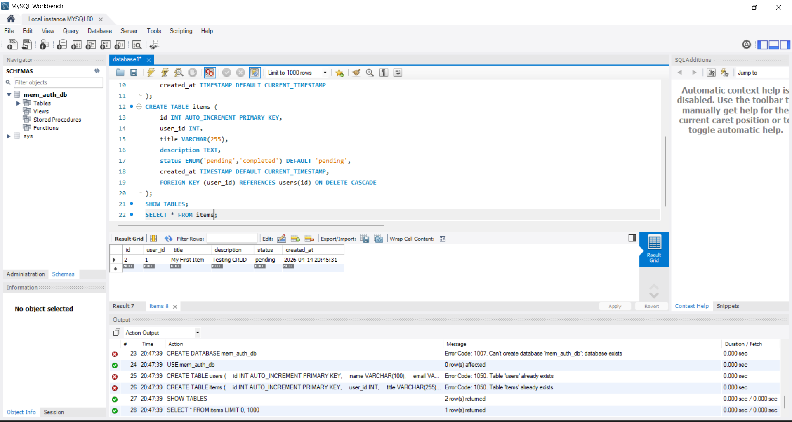

* Users table

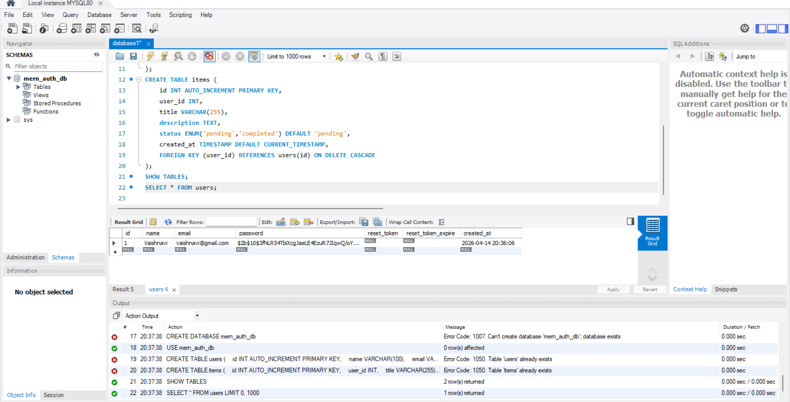

* Frontend:

* Login Page

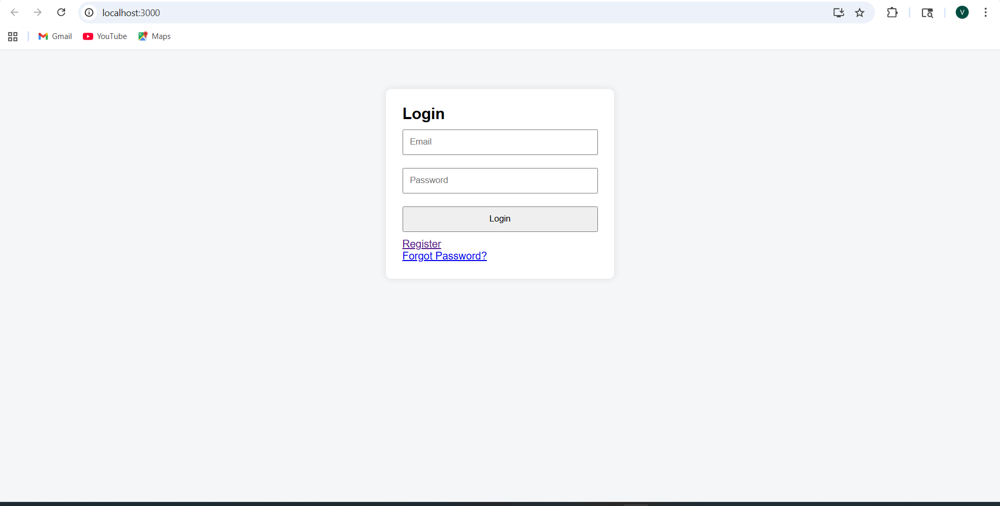

* Register Page

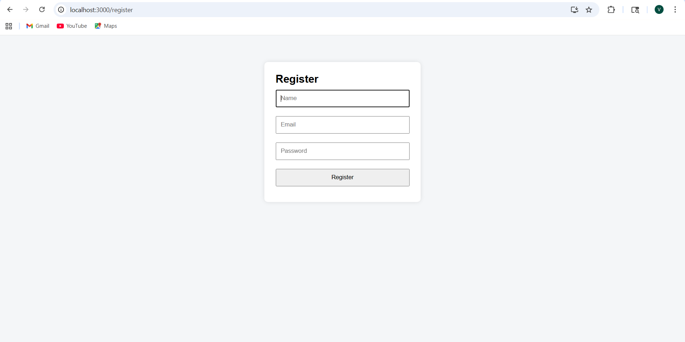

* Forgot Password Page

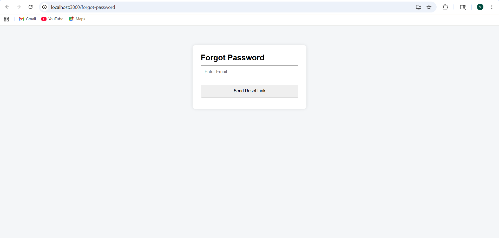

* Reset Password Page

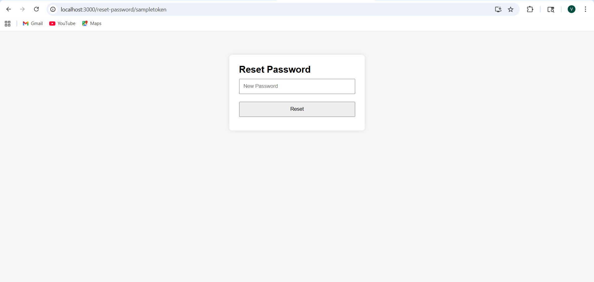

* Dashboard Page

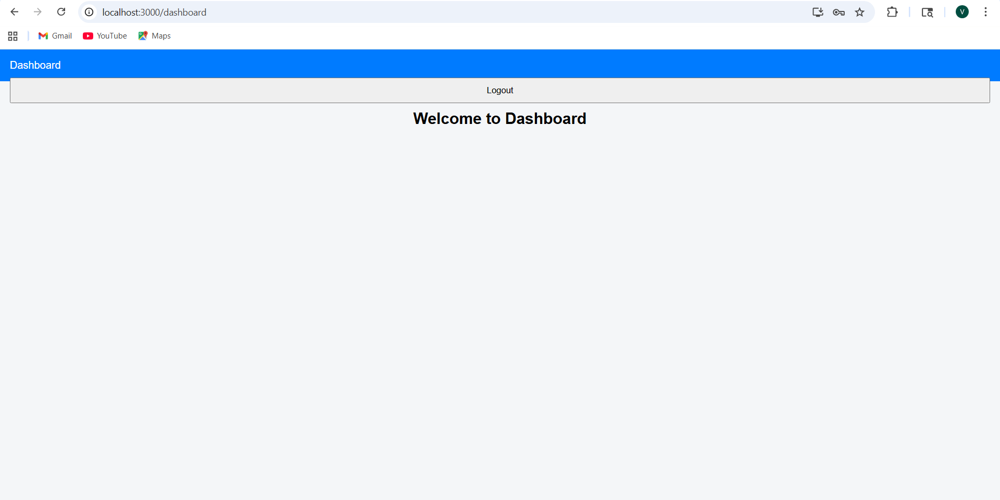

* Postman 

* Add Item Page:

* Delete Item Page:

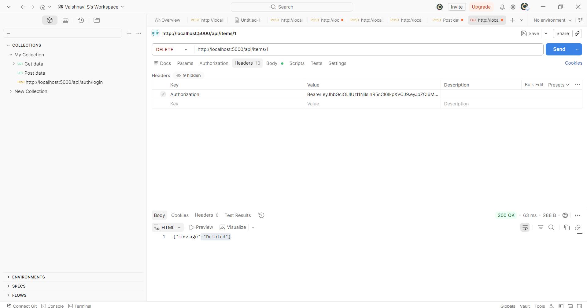

* Successful Registration:

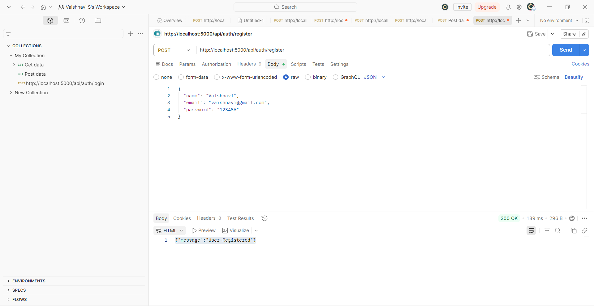

* Successful Login:

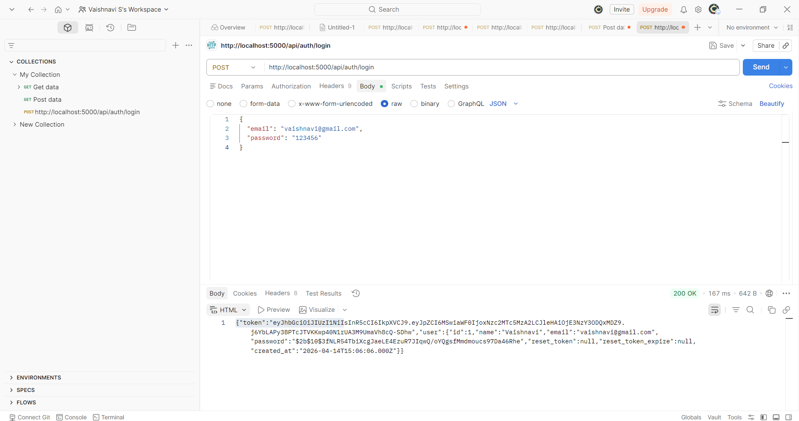

* Port

* Backend Port - Server running on 5000
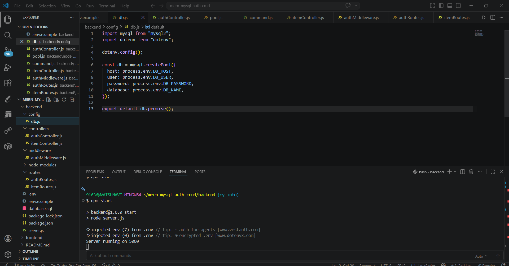

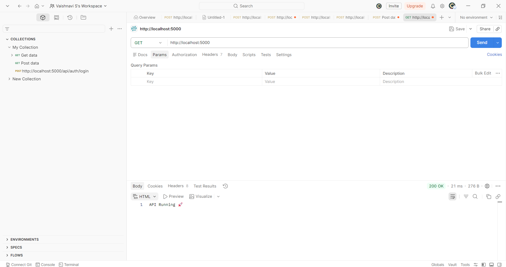

* Frontend Port - http://localhost:3000

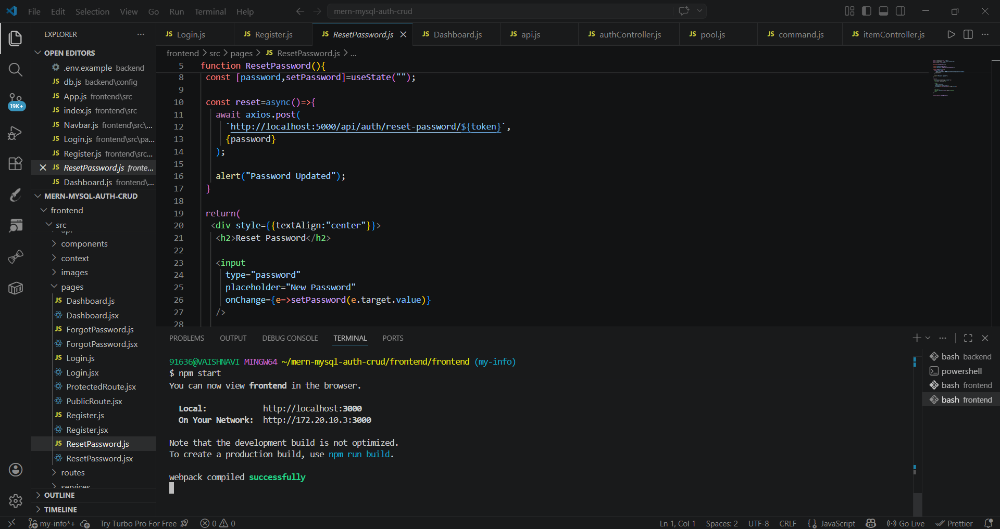

## 🔗 API Endpoints
* POST /api/auth/register – Register new user
* POST /api/auth/login – Login user & generate JWT
* POST /api/auth/forgot-password – Send password reset request
* PUT /api/auth/reset-password/:token – Reset password using token
* GET /api/dashboard – Fetch protected dashboard data
* POST /api/items – Add new item
* DELETE /api/items/:id – Delete item

## 🎯 Learning Outcomes

* Understanding MERN architecture
* REST API development
* Database connectivity using MySQL
* Authentication workflow implementation
* React component-based development
* Full Stack integration

## 👩‍💻 Author

**Vaishnavi S**
B.E. Computer Science and Engineering

## 📄 License

This project is developed for educational and academic purposes.
